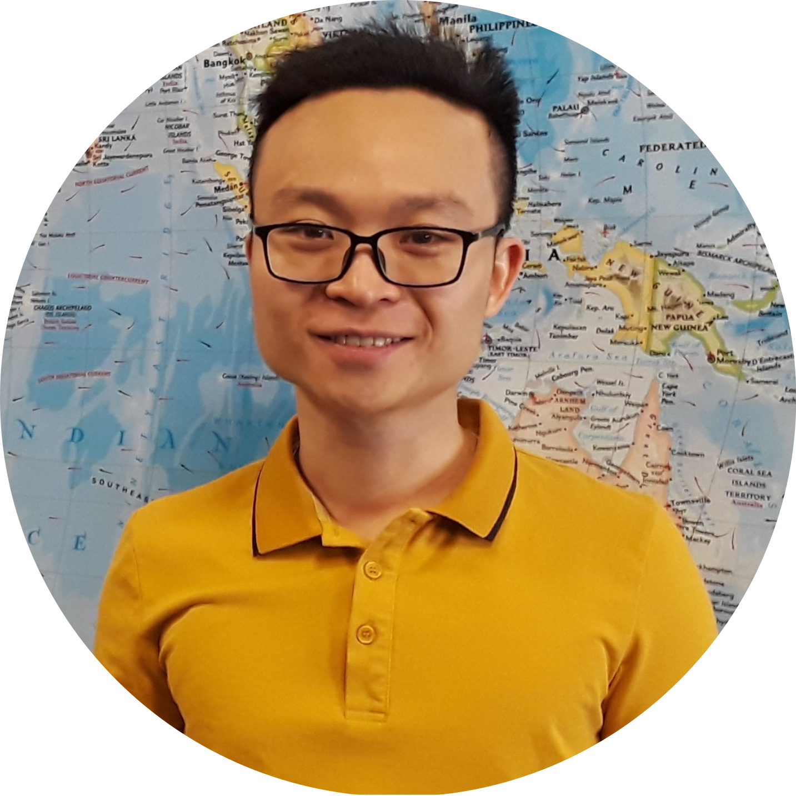

Welcome!

![Portrait of Hieu Minh Truong][1]

My name is Hieu Minh Truong. I am a Ph.D. student in [Microbiology][2] at the University of Wisconsin - Madison.  
Toward a sustainable world, I focus my doctoral research on using (friendly) *Clostridium* bacteria to convert waste materials into valuable industrial chemicals.  
I am happy to be part of the [Ujor Laboratory][3], Department of Food Science. Together, we hope to create an impact on the world.  

![Ujor Lab fun picture][4]
This Git repository houses code scripts related to my doctoral research, including those used for miscellaneous tasks as well as data analyses.  

Contact: [mtruong4@wisc.edu](mtruong4@wisc.edu)

[1]: 
 "Portrait of Hieu Minh Truong"
[2]: <https://microbiology.wisc.edu/> "Microbiology Doctoral Training Program at UW-Madison"
[3]: <https://foodsci.wisc.edu/ujor_lab/> "Ujor Laboratory website"
[4]: ./Pictures/LabPhoto_2022-03_2.jpg "Ujor Lab fun picture"